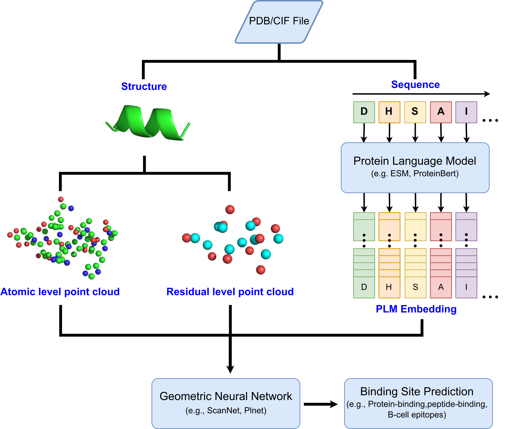

# S2Site: Accurate Protein binding site prediction with geometric deep learning and protein language model

S2Site (Sequence and Structure based Binding Site Prediction) is an end-to-end framework that extends the geometric deep learning model with the protein language model (PLM) to identify the protein binding sites. It accurately predicts protein binding sites on a large scale efficiently without relying on external softwares and databases of known protein-ligand templates. 

## Setup
Clone this repository
```
git clone https://github.com/LW-21/S2Site.git
cd S2Site
```

Create env:
```
conda env create -f environment.yml -n s2site
conda activate s2site
```

No other external software is necessary to run S2Site.
For PyTorch, gpu version is used by default.
Paths to the library, primary configurations are defined in utilities/configuration.py

## Predicting binding sites with S2Site
The script for predicting binding sites and visualizing them is predict_bindingsites.py, see some examples:

*Predict the protein-binding sites (PPBS) of a query protein*
```
python predict_bindingsites.py pdb_file --structure_folder path/to/folder --gpu_id 0
```

*Predict a list of protein-protein binding sites (PPBS) in one go*
```
python predict_bindingsites.py path/to/list/of/protein_ids.txt --structure_folder path/to/folder --gpu_id 0
```

*Predict B-cell epitopes (BCE) of HIV Envelope protein*
```
python predict_bindingsites.py 5fyl --interaction PAI4 --no_biounit --assembly --gpu_id cpu
```

*Predict the peptide-binding sites (PPeBS) of a query protein*
```
python predict_bindingsites.py 1lxg_A --no_biounit --interaction PPeI --gpu_id 0
```
- `pdb_file` can be any PDB files or biounit files. It can also be written as /path/file to directly load the file from the input path
- `--structure_folder` is the folder that store the query file, it serves as an alternative way to load files that are not stored in the default path as stated in `utilities.configuration`
- `--no_biounit` is used if the query file is either .pdb or .cif
- `--interaction` indicates the type of binding site that S2Site predicts
- `--assembly` indicates if S2Site perform prediction from single chains or from biological assemblies

For more options see `python predict_bindingsites.py --help`.

## Visualize the predicted binding sites
Outputs are located in the predictions folder. A prediction typically has the following files: 
```md
└── 1brs_single_S2Site_PPI_v0
    ├── annotated_1brs.cxc
    ├── annotated_1brs.pdb
    ├── annotated_1brs.py
    └── predictions_1brs.csv
```
- The .cxc file allows visualization of the result via ChimeraX https://www.rbvi.ucsf.edu/chimerax/ (right click -> open the file with chimeraX)
- The .pdb file is annotated with the predicted binding probability in the B-factor field
- The .py script for visualizing the results with Chimera
- The .csv file stores the Model, Chain, Residue Index, Sequence, and the Binding site probability of the query protein

## Reproducibility
See `utilities/configuration.py` and modify the path in the `reset_path` that suit your needs.

Option 1: Train the model to predict the protein binding sites in the protein-protein interaction
```
python train.py --version 100 --gpu_id 0
```

Option 2: Train the model to predict the protein binding sites in the antigen-antibody interaction
```
python train_bce.py --version 100 --gpu_id 0
```
Option 3: Transfer learning the model trained in (1) for the task in (2)
```
python tl_bce.py --version 101 --trained_model_id PPI_3Bv0 --gpu_id 0
```

Option 4: Train the model to predict the protein binding sites in the protein-peptide interaction
```
python train_ppe.py --version 100 --class_weight 0.25 1 --gpu_id 0 --epochs 10
```

Option 5: Transfer learning the model trained in (1) for the task in (4)
```
python train_ppe.py --version 101 --trained_model_id PPI_3Bv0 --gpu_id 0 --class_weight 0.25 1 --epochs 5
```

To evaluate the trained model on test sets for various proteion interactions
```
python visualization_ppi.py --model_ids PPI_3Bv0 --gpu_id 0
python visualization_bce.py --model_ids PAI_3Bv0 tlv0 --gpu_id 0
python visualization_ppe.py --model_ids PPeI_3Bv0 tlv0 --gpu_id 0
```

## Construct the dataset
See the `labels.txt` files in the datasets folder. An example to construct the test set involved in protein-peptide interaction is shown as follows:
```
from utilities import io_utils
from preprocessing import pipelines
import numpy as np

list_origins, list_sequences, list_resids, list_labels = io_utils.read_labels('/datasets/PPeBS/labels_TE125.txt', nmax=np.inf, label_type='int')
pipeline = pipelines.S2SitePipeline(with_atom=True, aa_features='esm', device='cuda:0')
inputs, outputs, fails = pipeline.build_processed_dataset('/PPeBS_ESM3B/PPeBS_TE125', list_origins=list_origins, list_resids=list_resids, list_labels=list_labels, biounit=False, ncores=1)
```
We recommend constructing the large pool of training examples used in the protein-protein interaction by firstly compute the `aa_feature=sequence` (one-hot encoding in ScanNet), follow by converting the residue-level attribute to the protein language model embeddings via `dataset2esm.py` and store each example independently rather than as a complete dataset. Otherwise, please modify the path of `self.cfg.dataset_wESM` in the `utilities.configuration.py`

## U-Net and RCNN
To train and evaluate the deep-learning baseline models, please use:
```
python train_baseline.py --version 100 --model_type rcnn --gpu_id 0
python train_baseline.py --version 100 --model_type unet --dropout 0 --gpu_id 0

python visualization_baseline.py --model_ids RCNN_ --gpu_id 0
python visualization_baseline.py --model_ids UNetv0_2 --gpu_id 0
```
## Contact
For any question and comment regarding the code, please reach out to linwei98126@gmail.com

## Reference
Coming soon
